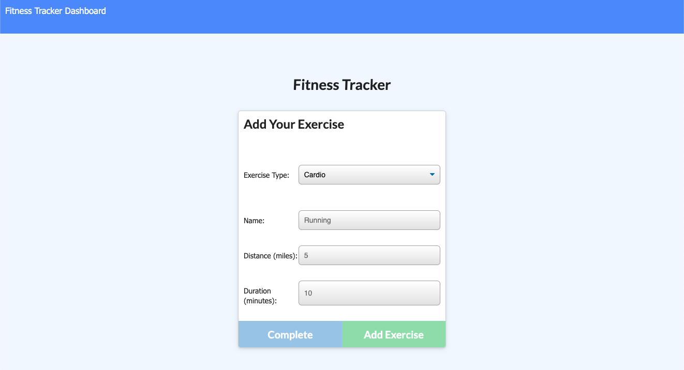
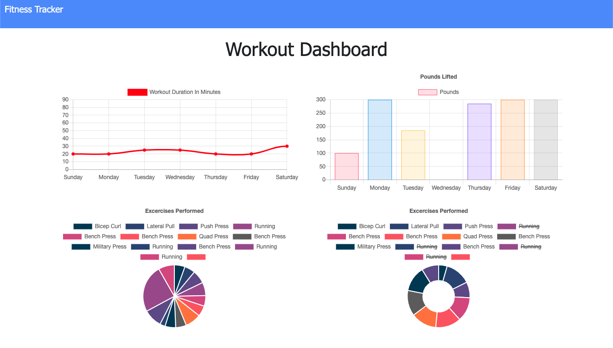

# fitness-tracker

  

  ## The Repository
  Link to repository: https://github.com/awebb8/fitness-tracker

  ## About
  The Fitness Tracker is an application built to track a user's workouts.  Users can create and track multiple workouts completed on a given day.  Users can also track the name, type, weight, sets, reps, and duration of exercise.  Additionally, if the exercise is a cardio exercise, the user can track the distance travelled. This application utilizes a Mongoose schema and handles routes with Express.  

  
  

  ## Table of Contents
  * [Installation](#installation)
  * [Usage](#usage)
  * [License](#License)
  * [Questions](#Questions)

  ## Installation
  Clone the generate-readme repository from GitHub.  Then utilize "npm install" to install dependencies, including Express and Mongoose.  For more information on Express, visit https://expressjs.com/.  For more information on Mongoose, visit https://www.npmjs.com/package/mongoose.

  ## Usage
  Upon loading the page, the user is given the option to create a new workout or continue with their last workout.  The user is then able to add exercises to a previous workout plan or add exercises to a new workout plan.  The user may view the combined weight of multiple exercises on the `stats` page.

  ## License
  This project is licensed under the terms of the MIT License.

  ## Questions
  Please direct all questions to [alixkwebb@gmail.com](alixkwebb@gmail.com)
  You may view and follow my GitHub profile by clicking the following link: https://github.com/awebb8
